# 🗺️ System Architecture & Infrastructure Maps
**Version:** 4.0 (Final - High-Fidelity)  
**Status:** ✅ Fully Hardened & Documented

---

## 1. High-Fidelity Infrastructure Map (Premium)
This visual represents the "Perfect" state of the infrastructure, following the Microsoft Azure Reference Architecture style. It highlights the logical grouping of services, the high-availability core, and the multi-layered security/observability stack.

---

## 2. Technical System Architecture (Full Stack)
The following Mermaid diagram provides the technical routing and component breakdown with integrated icons.

```mermaid
graph TD
    subgraph Users ["🌐 User Access Layer"]
        U["👤 Security Engineers / Admins"] --> VIP["🛠️ Virtual IP: 172.25.0.222"]
    end

    subgraph Access_Gateway ["🛡️ Access & HA Gateway"]
        VIP --> LB1["🌐 Nginx LB 1 (Active)"]
        VIP --> LB2["🌐 Nginx LB 2 (Standby)"]
        LB1 -- "vrrp_script" --- KA1["💓 Keepalived-1"]
        LB2 -- "vrrp_script" --- KA2["💓 Keepalived-2"]
    end

    subgraph Core_SIEM ["🧠 Core Wazuh Cluster"]
        LB1 --> WM["👑 Wazuh Master (API/Auth)"]
        LB1 --> WW["👷 Wazuh Worker (Data)"]
        WM -.->|"Cluster Sync"| WW
    end

    subgraph Storage ["🗄️ Distributed Indexer Cluster"]
        WW --> IDX_LB["🔄 Indexer Load Balancing"]
        IDX_LB --> IDX1["💾 Indexer 1"]
        IDX_LB --> IDX2["💾 Indexer 2"]
        IDX_LB --> IDX3["💾 Indexer 3"]
    end

    subgraph Observability ["📊 Observability & Monitoring"]
        PROM["🔥 Prometheus"] --- CAD["🐳 cAdvisor"]
        PROM --- NODE["🖥️ Node Exporter"]
        PROM --> GRAF["📈 Grafana Dashboards"]
        ZAB["🐆 Zabbix Server"] --> DB["🐘 Zabbix DB (Postgres)"]
        ZAB --> AGENTS["📡 Zabbix Agents"]
    end

    subgraph Security ["🔒 Threat Intelligence Layer"]
        GRAY["📁 Graylog (Log Management)"]
        BEEL["🐝 Beelzebub (Honeypot)"]
        COWRIE["🐄 Cowrie (SSH/Telnet)"]
        BEEL --> WM
        COWRIE --> WM
        WM --> GRAY
    end

    %% Styling
    classDef gateway fill:#e1f5fe,stroke:#01579b,stroke-width:2px;
    classDef core fill:#fff3e0,stroke:#e65100,stroke-width:2px;
    classDef storage fill:#f3e5f5,stroke:#4a148c,stroke-width:2px;
    classDef monitor fill:#f1f8e9,stroke:#1b5e20,stroke-width:2px;
    classDef security fill:#ffebee,stroke:#b71c1c,stroke-width:2px;

    class LB1,LB2,VIP gateway;
    class WM,WW core;
    class IDX1,IDX2,IDX3 storage;
    class PROM,GRAF,ZAB monitor;
    class GRAY,BEEL,COWRIE security;
```

---

## 3. Failover & Health Workflow Diagram
This diagram visualizes the **Active HA** logic where Keepalived monitors the Nginx process health.

```mermaid
sequenceDiagram
    participant U as 👤 User/Agent
    participant VIP as 🛠️ Virtual IP (172.25.0.222)
    participant LB1 as 🌐 Nginx LB 1 (Master)
    participant LB2 as 🌐 Nginx LB 2 (Backup)
    participant MON as 💓 Keepalived Health Check

    U->>VIP: Access Dashboard/API
    VIP->>LB1: Traffic Routed to Master
    
    loop Every 3 Seconds
        MON->>LB1: curl -s -f http://localhost:81/nginx_status
        alt Nginx is Healthy
            MON-->>LB1: OK (Priority 101)
        else Nginx Fails
            MON-->>LB1: FAIL (Priority -20)
            Note over LB1,LB2: Priority drops to 81
            LB1->>VIP: Release VIP
            LB2->>VIP: Takeover VIP (Priority 100)
            Note right of LB2: LB2 becomes Active Master
        end
    end

    U->>VIP: Access Continued
    VIP->>LB2: Traffic Routed to New Master
```

---

## 4. Integrated Data Flow
The path of a security event from detection to visualization.

```mermaid
flowchart LR
    subgraph Detection
        BEEL["🐝 Beelzebub"]
        COW["🐄 Cowrie"]
        AG["📡 Wazuh Agent"]
    end

    subgraph Processing
        WM["🧠 Wazuh Manager"]
        WM -->|Rule Match| AL["🚨 JSON Alert"]
    end

    subgraph LongTerm
        AL -->|Fluentd/GELF| GL["📁 Graylog"]
    end

    subgraph Search
        AL -->|Indexing| IDX["🗄️ Indexer Cluster"]
    end

    subgraph Visualization
        IDX -->|Query| DB["📊 Wazuh Dashboard"]
        GL -->|Search| GV["🔍 Graylog UI"]
        GRAF["📈 Grafana"] -->|Metrics| PROM["🔥 Prometheus"]
    end

    BEEL --> WM
    COW --> WM
    AG --> WM
```

---

## 5. Access Matrix (Service Directory)
Use these endpoints to access the system via the **Shared Virtual IP (172.25.0.222)**.

| Service | Protocol | Port | URL / Endpoint |
| :--- | :--- | :--- | :--- |
| **🌐 Wazuh Dashboard** | HTTPS | 443 | [https://172.25.0.222](https://172.25.0.222) |
| **📈 Grafana** | HTTP | 3000 | [http://172.25.0.222:3000](http://172.25.0.222:3000) |
| **🐆 Zabbix UI** | HTTP | 8080 | [http://172.25.0.222:8080](http://172.25.0.222:8080) |
| **📂 Graylog UI** | HTTP | 9000 | [http://172.25.0.222:9000](http://172.25.0.222:9000) |
| **🔥 Prometheus** | HTTP | 9090 | [http://172.25.0.222:9090](http://172.25.0.222:9090) |
| **📡 Wazuh API** | HTTPS | 55000 | [https://172.25.0.222:55000](https://172.25.0.222:55000) |
| **📥 Agent Enrollment**| TCP | 1515 | `172.25.0.222` |
| **📤 Agent Connection**| UDP/TCP| 1514 | `172.25.0.222` |
| **💾 Indexer API** | HTTPS | 9200 | [https://172.25.0.222:9200](https://172.25.0.222:9200) |
