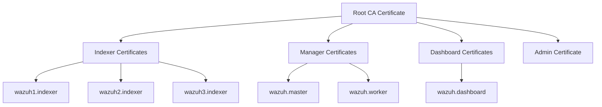

# 🔐 Complete Certificate Generation Guide for Wazuh SIEM

> **Critical Component**: SSL/TLS certificates are the foundation of secure communication in your Wazuh deployment. This guide ensures you understand every step.

---

## 📋 Table of Contents

1. [Why Certificates Matter](#why-certificates-matter)
2. [Certificate Architecture](#certificate-architecture)
3. [Pre-Generation Checklist](#pre-generation-checklist)
4. [Step-by-Step Generation Process](#step-by-step-generation-process)
5. [Understanding the Generated Files](#understanding-the-generated-files)
6. [Verification & Testing](#verification--testing)
7. [Common Issues & Solutions](#common-issues--solutions)
8. [Production Best Practices](#production-best-practices)

---

## Why Certificates Matter

### What They Secure
- **Indexer Cluster Communication**: Ensures data integrity between the 3 Indexer nodes
- **Manager → Indexer**: Protects alert data sent from Wazuh Managers to the Indexer
- **Dashboard → Indexer**: Secures queries and visualizations
- **Admin Access**: Authenticates administrative operations

### What Happens Without Proper Certificates
❌ **Indexer cluster won't form** - Nodes can't authenticate each other  
❌ **Managers can't send alerts** - Filebeat SSL verification fails  
❌ **Dashboard shows errors** - Can't connect to backend  
❌ **Security vulnerabilities** - Man-in-the-middle attacks possible

---

## Certificate Architecture



### Certificate Hierarchy
1. **Root CA** (`root-ca.pem`) - The trust anchor for all certificates
2. **Node Certificates** - Individual certificates for each service
3. **Private Keys** - Secret keys that must NEVER be shared

---

## Pre-Generation Checklist

Before generating certificates, ensure:

### ✅ System Requirements
- [ ] Docker and Docker Compose installed
- [ ] You're in the `multi-node` directory
- [ ] You have write permissions to `config/` directory

### ✅ Configuration File Ready
The certificate generator uses `config/certs.yml` to know which certificates to create.

**Check if it exists:**
```bash
ls -la config/certs.yml
```

**If missing, the bootstrap script will handle it, or you can create it manually** (see below).

### ✅ Clean State
Remove any old/corrupted certificates:
```bash
# IMPORTANT: Only run this if you're starting fresh
rm -rf config/wazuh_indexer_ssl_certs/*
```

---

## Step-by-Step Generation Process

### Method 1: Using Bootstrap Script (Recommended)

The `bootstrap.sh` script handles everything automatically:

```bash
cd /path/to/Secret-Project/multi-node
sudo bash bootstrap.sh
```

**What it does:**
1. ✅ Checks if certificates exist
2. ✅ Creates `config/certs.yml` if missing
3. ✅ Runs the certificate generator container
4. ✅ Sets correct permissions
5. ✅ Validates the generated files

---

### Method 2: Manual Generation (For Understanding)

#### Step 1: Ensure `certs.yml` Exists

Create `config/certs.yml` with this content:

```yaml
nodes:
  # Indexer nodes
  indexer:
    - name: wazuh1.indexer
      ip: wazuh1.indexer
    - name: wazuh2.indexer
      ip: wazuh2.indexer
    - name: wazuh3.indexer
      ip: wazuh3.indexer

  # Wazuh Manager nodes
  server:
    - name: wazuh.master
      ip: wazuh.master
      node_type: master
    - name: wazuh.worker
      ip: wazuh.worker
      node_type: worker

  # Dashboard
  dashboard:
    - name: wazuh.dashboard
      ip: wazuh.dashboard
```

**Critical Notes:**
- The `name` field must match the Docker service name in `docker-compose.yml`
- The `ip` field can be a hostname (Docker DNS resolves it)
- For production with real IPs, replace hostnames with actual IP addresses

---

#### Step 2: Run the Certificate Generator

```bash
cd multi-node
docker compose -f generate-indexer-certs.yml run --rm generator
```

**What happens:**
1. Downloads the official Wazuh certificate generator image
2. Reads `config/certs.yml`
3. Generates a Root CA certificate
4. Creates individual certificates for each node
5. Saves everything to `config/wazuh_indexer_ssl_certs/`

**Expected output:**
```
Checking https://packages.wazuh.com/4.14/wazuh-certs-tool.sh ...
Downloaded wazuh-certs-tool.sh from https://packages.wazuh.com/4.14/
INFO: Generating the root certificate.
INFO: Generating Admin certificates.
INFO: Admin certificates created.
INFO: Generating Wazuh indexer certificates.
INFO: Wazuh indexer certificates created.
INFO: Generating Filebeat certificates.
INFO: Wazuh Filebeat certificates created.
INFO: Generating Wazuh dashboard certificates.
INFO: Wazuh dashboard certificates created.
```

---

#### Step 3: Fix Permissions

Docker creates files as root, so we need to fix ownership:

```bash
sudo chown -R $USER:$USER config/wazuh_indexer_ssl_certs/
chmod 755 config/wazuh_indexer_ssl_certs/
chmod 644 config/wazuh_indexer_ssl_certs/*.pem
chmod 644 config/wazuh_indexer_ssl_certs/*-key.pem
```

**Why this matters:**
- Docker containers run as specific UIDs (e.g., Graylog uses UID 1100)
- If permissions are wrong, services fail to read certificates
- This causes "Permission denied" or "SSL handshake failed" errors

---

## Understanding the Generated Files

After generation, you'll have these files in `config/wazuh_indexer_ssl_certs/`:

### 📁 Certificate Inventory

| File | Purpose | Used By |
|------|---------|---------|
| `root-ca.pem` | Root Certificate Authority | All services (trust anchor) |
| `admin.pem` / `admin-key.pem` | Admin access to Indexer | Indexer admin operations |
| `wazuh1.indexer.pem` / `wazuh1.indexer-key.pem` | Indexer Node 1 | wazuh1.indexer service |
| `wazuh2.indexer.pem` / `wazuh2.indexer-key.pem` | Indexer Node 2 | wazuh2.indexer service |
| `wazuh3.indexer.pem` / `wazuh3.indexer-key.pem` | Indexer Node 3 | wazuh3.indexer service |
| `wazuh.master.pem` / `wazuh.master-key.pem` | Master Manager (Filebeat) | wazuh.master service |
| `wazuh.worker.pem` / `wazuh.worker-key.pem` | Worker Manager (Filebeat) | wazuh.worker service |
| `wazuh.dashboard.pem` / `wazuh.dashboard-key.pem` | Dashboard | wazuh.dashboard service |

### 🔍 File Breakdown

**`.pem` files** = Public certificates (safe to share within your infrastructure)  
**`-key.pem` files** = Private keys (MUST be kept secret)

---

## Verification & Testing

### 1. Check Files Were Created

```bash
ls -lh config/wazuh_indexer_ssl_certs/
```

**Expected output:**
```
-rw-r--r-- 1 user user 1.2K admin-key.pem
-rw-r--r-- 1 user user 1.3K admin.pem
-rw-r--r-- 1 user user 1.1K root-ca.pem
-rw-r--r-- 1 user user 1.2K wazuh1.indexer-key.pem
-rw-r--r-- 1 user user 1.3K wazuh1.indexer.pem
... (and so on)
```

---

### 2. Verify Certificate Details

```bash
# Check certificate validity period
openssl x509 -in config/wazuh_indexer_ssl_certs/wazuh1.indexer.pem -noout -dates

# View full certificate details
openssl x509 -in config/wazuh_indexer_ssl_certs/wazuh1.indexer.pem -text -noout
```

**Look for:**
- `Not Before` and `Not After` dates (certificates are valid for 3 years by default)
- `Subject Alternative Name` (should include the node hostname)

---

### 3. Verify Certificate and Key Match

```bash
# Get certificate modulus
openssl x509 -noout -modulus -in config/wazuh_indexer_ssl_certs/wazuh1.indexer.pem | openssl md5

# Get key modulus
openssl rsa -noout -modulus -in config/wazuh_indexer_ssl_certs/wazuh1.indexer-key.pem | openssl md5
```

**The MD5 hashes MUST match!** If they don't, the certificate and key are mismatched.

---

### 4. Test After Deployment

Once the stack is running:

```bash
# Test Indexer SSL
curl -k -u admin:SecretPassword https://172.25.0.222:9200

# Test with certificate verification (should succeed)
curl --cacert config/wazuh_indexer_ssl_certs/root-ca.pem \
     -u admin:SecretPassword https://172.25.0.222:9200
```

---

## Common Issues & Solutions

### ❌ Issue 1: "Permission denied" when reading certificates

**Symptoms:**
```
ERROR: Could not read certificate file
Permission denied: /usr/share/wazuh-indexer/config/certs/wazuh1.indexer.pem
```

**Solution:**
```bash
sudo chmod 644 config/wazuh_indexer_ssl_certs/*.pem
sudo chmod 644 config/wazuh_indexer_ssl_certs/*-key.pem
```

---

### ❌ Issue 2: "Not a directory" mount errors

**Symptoms:**
Docker creates directories instead of expecting files.

**Solution:**
```bash
# Remove any directories that should be files
find config/wazuh_indexer_ssl_certs -type d -name "*.pem" -exec rm -rf {} +

# Regenerate certificates
docker compose -f generate-indexer-certs.yml run --rm generator
```

---

### ❌ Issue 3: Indexer cluster won't form

**Symptoms:**
```
[WARN] SSL handshake failed
[ERROR] Not all primary shards are active
```

**Solution:**
1. Verify all 3 indexer certificates exist
2. Check that `root-ca.pem` is the same for all nodes
3. Restart indexers one by one:
   ```bash
   docker restart wazuh1.indexer
   sleep 30
   docker restart wazuh2.indexer
   sleep 30
   docker restart wazuh3.indexer
   ```

---

### ❌ Issue 4: Dashboard can't connect to Indexer

**Symptoms:**
```
ERROR: Unable to connect to Elasticsearch
SSL certificate verification failed
```

**Solution:**
```bash
# Verify dashboard certificate exists
ls -la config/wazuh_indexer_ssl_certs/wazuh.dashboard.pem

# Check dashboard logs
docker logs wazuh.dashboard | grep -i ssl

# Restart dashboard
docker restart wazuh.dashboard
```

---

## Production Best Practices

### 🔒 Security

1. **Never commit certificates to Git:**
   ```bash
   echo "*.pem" >> .gitignore
   echo "*.key" >> .gitignore
   ```

2. **Use strong encryption:**
   - Default generator uses 2048-bit RSA (good)
   - For high-security environments, use 4096-bit

3. **Rotate certificates regularly:**
   - Set calendar reminders 30 days before expiration
   - Test rotation in staging first

---

### 📊 Monitoring

Set up certificate expiration monitoring:

```bash
# Check expiration date
openssl x509 -in config/wazuh_indexer_ssl_certs/wazuh1.indexer.pem -noout -enddate

# Get days until expiration
echo $(( ($(date -d "$(openssl x509 -in config/wazuh_indexer_ssl_certs/wazuh1.indexer.pem -noout -enddate | cut -d= -f2)" +%s) - $(date +%s)) / 86400 ))
```

---

### 🔄 Certificate Rotation Procedure

When certificates are about to expire:

1. **Backup current certificates:**
   ```bash
   cp -r config/wazuh_indexer_ssl_certs config/wazuh_indexer_ssl_certs.backup.$(date +%Y%m%d)
   ```

2. **Generate new certificates:**
   ```bash
   docker compose -f generate-indexer-certs.yml run --rm generator
   ```

3. **Rolling restart (zero downtime):**
   ```bash
   # Restart indexers one at a time
   docker restart wazuh1.indexer && sleep 60
   docker restart wazuh2.indexer && sleep 60
   docker restart wazuh3.indexer && sleep 60
   
   # Restart managers
   docker restart wazuh.master wazuh.worker
   
   # Restart dashboard
   docker restart wazuh.dashboard
   ```

4. **Verify cluster health:**
   ```bash
   curl -k -u admin:SecretPassword https://172.25.0.222:9200/_cluster/health?pretty
   ```

---

## Quick Reference Commands

```bash
# Generate certificates
docker compose -f generate-indexer-certs.yml run --rm generator

# Fix permissions
sudo chmod 644 config/wazuh_indexer_ssl_certs/*.pem

# Verify certificate
openssl x509 -in config/wazuh_indexer_ssl_certs/wazuh1.indexer.pem -text -noout

# Check expiration
openssl x509 -in config/wazuh_indexer_ssl_certs/wazuh1.indexer.pem -noout -dates

# Test SSL connection
curl --cacert config/wazuh_indexer_ssl_certs/root-ca.pem \
     -u admin:SecretPassword https://172.25.0.222:9200
```

---

## 🎯 Summary

**Before `docker compose up -d`:**
1. ✅ Generate certificates with `docker compose -f generate-indexer-certs.yml run --rm generator`
2. ✅ Fix permissions with `chmod 644 config/wazuh_indexer_ssl_certs/*.pem`
3. ✅ Verify files exist: `ls -la config/wazuh_indexer_ssl_certs/`
4. ✅ Check one certificate: `openssl x509 -in config/wazuh_indexer_ssl_certs/wazuh1.indexer.pem -noout -dates`

**Or just use the bootstrap script:**
```bash
sudo bash bootstrap.sh
```

It handles everything automatically! 🚀

---

**Questions?** Check the [official Wazuh documentation](https://documentation.wazuh.com/current/deployment-options/docker/wazuh-container.html#certificates-creation) or review the existing `CERTIFICATE_GENERATION.md` file.
