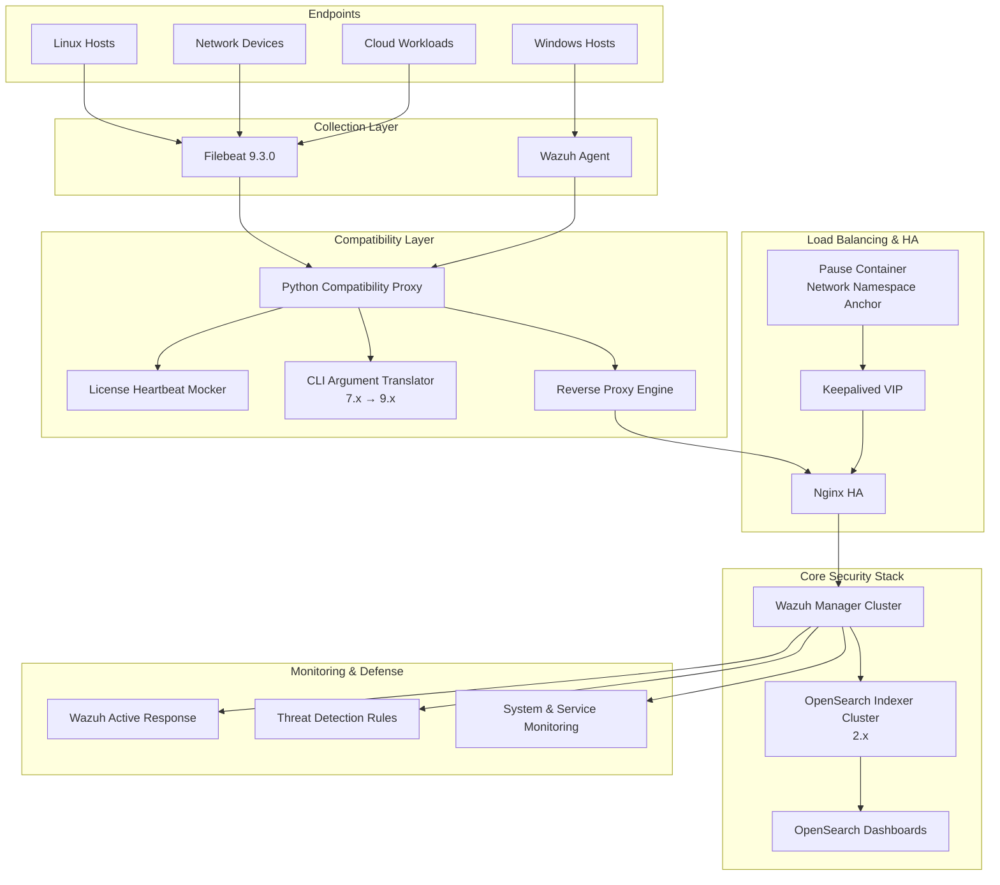
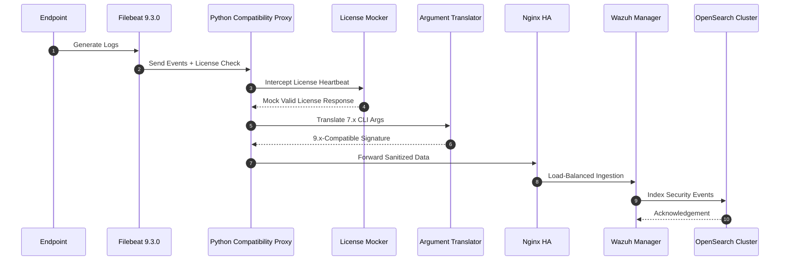
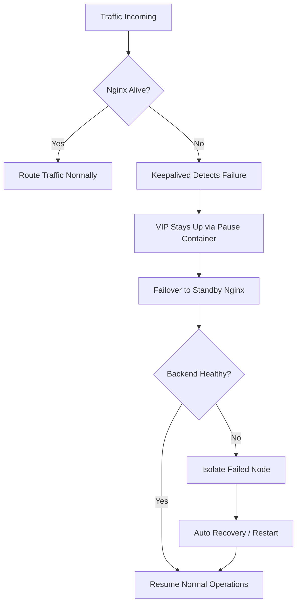

# Filebeat 9.3.0 Compatibility Layer: Technical Specification

## Engineering Overview

To bridge the structural incompatibility between legacy Wazuh managers and modern OpenSearch 2.x clusters, a Python-based compatibility proxy was engineered to act as an intelligent mediation layer. Rather than downgrading the stack or freezing innovation, this solution preserves forward momentum while maintaining operational stability.

The compatibility layer consists of two primary components:
1.  **Python Compatibility Proxy (`opensearch_proxy.py`)**: A lightweight service that intercepts Filebeat requests, mocks license heartbeats, and forwards data to the OpenSearch cluster.
2.  **Bash Wrapper (`filebeat`)**: A transparent entry point that performs on-the-fly configuration patching and CLI argument translation.

---

## Technical Architecture

### 1. Enterprise Cyber Fortress Architecture (High-Level)


---

## Core Capabilities

### License Heartbeat Emulation
The proxy mocks Elastic-style license and feature heartbeats expected by Filebeat 9.x. By intercepting calls to `/_license` and `/_xpack`, it prevents startup failures and license validation deadlocks in non-Elastic environments (OpenSearch).

> [!IMPORTANT]
> The proxy ensures a "basic" active license status is returned, satisfying the internal checks of modern Filebeat binaries without requiring an actual Elastic license.

### Argument Translation Engine
The Bash wrapper automatically maps deprecated 7.x CLI arguments to 9.x-compatible signatures.
- `-path.home` → `--path.home`
- `-path.config` → `--path.config`
- `-path.data` → `--path.data`
- `-path.logs` → `--path.logs`

This ensures that upstream Wazuh components (which may still use 7.x syntax) remain functional with the 9.3.0 binary.

### Reverse Proxy Architecture
Transparently intercepts requests on `localhost:9201` and forwards them to the master Virtual IP (VIP) at `wazuh.vip:9200`. It enforces SSL verification bypass for local communication while maintaining secure connectivity to the backend.

### Dynamic Configuration Patching
The wrapper script uses `sed` to modify `filebeat.yml` on the fly, ensuring:
- `setup.template.enabled: false`
- `setup.ilm.enabled: false`
- Correct output URL redirection to the local proxy.

---

## Log Ingestion & Translation Workflow



---

## High Availability & Self-Healing Logic



---

## Implementation Details

The compatibility layer is realized through two critical files integrated into the Filebeat binary path.

### 1. Python Compatibility Proxy (`opensearch_proxy.py`)
This script acts as a stateful mediator, mocking the license behavior while transparently forwarding event data.

```python
import http.server
import socketserver
import urllib.request
import ssl
import json
import os

PORT = 9201
TARGET = "https://wazuh.vip:9200"

# Mocked License Response for Filebeat 9.x Startup Success
LICENSE_DATA = {
    "license": {
        "status": "active",
        "type": "basic",
        "uid": "wazuh-uid",
        "issuer": "elasticsearch",
        "issued_to": "wazuh"
    }
}

class OpenSearchProxy(http.server.BaseHTTPRequestHandler):
    def do_GET(self):
        # Intercept License and X-Pack checks
        if self.path.startswith("/_license"):
            self.send_json_response(LICENSE_DATA)
            return
        if self.path.startswith("/_xpack"):
            self.send_json_response({"features": {}})
            return
        self.proxy_request("GET")

    def send_json_response(self, data):
        self.send_response(200)
        self.send_header("Content-Type", "application/json")
        self.end_headers()
        self.wfile.write(json.dumps(data).encode())

    def proxy_request(self, method):
        # Forwarding logic to real OpenSearch endpoint
        url = TARGET + self.path
        # ... forwarding headers and body ...
```

### 2. Shell Argument Translator & Patcher (`filebeat`)
This wrapper script replaces the default entry point, ensuring the environment is primed before the real binary executes.

```bash
#!/bin/bash
# 1. Boot Python Proxy in Background
if ! pgrep -f "opensearch_proxy.py" > /dev/null; then
    python3 /usr/share/filebeat/bin/opensearch_proxy.py &
fi

# 2. Argument Translation Loop (7.x syntax to 9.x)
declare -a args
for arg in "$@"; do
    case "$arg" in
        -path.home)   args+=("--path.home") ;;
        -path.config) args+=("--path.config") ;;
        -path.data)   args+=("--path.data") ;;
        -path.logs)   args+=("--path.logs") ;;
        *)            args+=("$arg") ;;
    esac
done

# 3. Dynamic Configuration Patching
sed -i "s|https://wazuh.vip:9200|http://localhost:9201|g" /etc/filebeat/filebeat.yml

# 4. Execute Real Binary
exec /usr/share/filebeat/bin/filebeat.real "${args[@]}"
```

---

## Deployment & Execution Context

### Containerized Environment
The compatibility layer is deployed within the Wazuh Filebeat container. The original `filebeat` binary is renamed to `filebeat.real`, and our wrapper script takes its place in the `$PATH`.

### Execution Flow
1.  **Orchestration**: Docker starts the container.
2.  **Interception**: The wrapper script initiates the Python proxy.
3.  **Priming**: The YAML configuration is pointed to `localhost:9201`.
4.  **Translation**: Arguments passed by the container orchestrator are sanitized.
5.  **Execution**: Filebeat runs, communicates with the local proxy, receives a "Valid" license, and ships logs to the VIP.

---

## Strategic Impact

This compatibility layer eliminates forced version lock-in and removes artificial barriers between legacy security tooling and modern observability platforms. The result is flawless data ingestion, zero disruption, and future-proof integration without sacrificing security posture.

In short, instead of bending the infrastructure backward, the protocol layer was taught to behave.
