# Enterprise-Grade Wazuh SIEM: The Ultimate Architecture & Operations Guide
## Advanced High Availability, SSL Persistence & Full-Stack Cyber Resilience

**Author:** Abu Saeid  
**Version:** 4.0.0 (Enterprise Gold Edition)  
**Classification:** Restricted Technical Manual  
**Repository:** [GitHub](https://github.com/SaeidSec/Docker-base-Enterprise-Grade-Wazuh-SIEM-Advanced-Load-Balancing-and-High-Availability-Architecture)

---

# Table of Contents
1.  [Executive Summary](#1-executive-summary)
2.  [Master Architectural Overview](#2-master-architectural-overview)
3.  [The High Availability Resilience Engine](#3-the-high-availability-resilience-engine)
4.  [SSL Certificate Architecture & VIP SAN Patching](#4-ssl-certificate-architecture--vip-san-patching)
5.  [Wazuh Core Cluster Analysis](#5-wazuh-core-cluster-analysis)
6.  [Full-Stack Observability Tier (Zabbix & Grafana)](#6-full-stack-observability-tier-zabbix--grafana)
7.  [Active Defense: AI Honeypots & Threat Intel](#7-active-defense-ai-honeypots--threat-intel)
8.  [Vulnerability Management & Trivy Integration](#8-vulnerability-management--trivy-integration)
9.  [Operational Bootstrap & Maintenance](#9-operational-bootstrap--maintenance)
10. [Strategic Conclusion](#10-strategic-conclusion)

---

## 1. Executive Summary

This documentation details the engineering of a **Production-Ready Wazuh SIEM** ecosystem. Unlike standard containerized deployments which suffer from networking fragility and slow initialization, this architecture implements a **Network-Decoupled Persistence Layer** and an **Automated SSL Trust Chain**.

The result is a self-healing security platform capable of:
*   **Instant Failover**: VRRP-based VIP persistence with Unicast optimization.
*   **Rapid Initialization**: Startup time optimized from 9 minutes to **under 120 seconds** via SSL SAN patching.
*   **Universal Monitoring**: 32+ containers monitored via a unified Zabbix/Prometheus/Grafana mesh.

---

## 2. Master Architectural Overview

The system operates as a tiered microservices mesh. The heart of the resilience is the **Virtual IP (VIP) `172.25.0.222`**, which serves as the single point of entry for all agents and administrative users.

### 2.1 Unified Architectural Logic

```mermaid
graph TD
    subgraph "External Security Perimeter"
        VIP["🛡️ VIP: 172.25.0.222 (wazuh.vip)"]
        KA1["Keepalived-1 (Active)"]
        KA2["Keepalived-2 (Passive)"]
        VIP --- KA1
        KA1 -.->|"Unicast Peering"| KA2
    end

    subgraph "Layer 1: Persistence Anchors"
        LB_ANCHOR1[("⚓ lb-node-1 (Pause)")]
        LB_ANCHOR2[("⚓ lb-node-2 (Pause)")]
        NGINX1["🌐 Nginx Load Balancer 1"]
        NGINX2["🌐 Nginx Load Balancer 2"]
        
        LB_ANCHOR1 --- NGINX1
        LB_ANCHOR2 --- NGINX2
    end

    subgraph "Layer 2: Wazuh SIEM Cluster"
        WM["👑 Wazuh Master"]
        WW["👷 Wazuh Worker"]
        WD["📊 Wazuh Dashboard"]
        
        subgraph "Indexer Data Tier"
            IDX1[("Indexer-1")]
            IDX2[("Indexer-2")]
            IDX3[("Indexer-3")]
            IDX1 --- IDX2 --- IDX3
        end
    end

    subgraph "Layer 3: Monitoring & Observability"
        ZABBIX["🔍 Zabbix 7.0 Server"]
        GRAFANA["📈 Grafana Master"]
        PROM["🔥 Prometheus TSDB"]
        GRAYLOG["📝 Graylog 7.0 (Data Lake)"]
    end

    subgraph "Layer 4: Active Defense"
        BEELZEBUB["😈 Beelzebub AI HP"]
        COWRIE["🐚 Cowrie SSH HP"]
    end

    %% Interactions
    VIP --> NGINX1
    NGINX1 --> WM
    NGINX1 --> WW
    NGINX1 --> WD
    
    WM --> IDX1
    WW --> IDX1
    WD --> IDX1
    
    BEELZEBUB -.->|"JSON Alerts"| WM
    COWRIE -.->|"JSON Alerts"| WM
    
    WM --> GRAYLOG
    ZABBIX --> GRAFANA
    PROM --> GRAFANA
    IDX1 --> GRAFANA
```


---

## 3. The High Availability Resilience Engine

### 3.1 The "Pause Container" Pattern
To prevent network drops during Nginx reloads or crashes, we utilize a **Pause Container Strategy**. 
*   **Execution**: The `lb-node` (Alpine) holds the network namespace.
*   **Result**: Even if the Nginx container dies or is updated, the Virtual IP (VIP) and TCP sessions remain locked in the kernel-level namespace of the `lb-node`.

### 3.2 Unicast Failover Optimization
To accommodate cloud environments and restricted physical networks where Multicast is blocked, we implemented a **Unicast VRRP Configuration**.
*   **Logic**: Keepalived nodes communicate directly via explicit IP peering rather than broadcasting.
*   **Configuration Snippet**:
```bash
unicast_peer {
    172.25.0.11 # IP of Node 2
}
```

---

## 4. SSL Certificate Architecture & VIP SAN Patching

### 4.1 The Startup Latency Problem
Initially, the stack required ~9 minutes to start. Diagnosis identified that the **Wazuh Manager (Filebeat)** and **Dashboard** were connecting to the Indexer cluster via the VIP (`https://wazuh.vip:9200`), but the Indexer's certificates did not trust the VIP name. This caused repeated SSL handshakes and multi-minute timeouts.

### 4.2 The Solution: SSL SAN Injection
We developed a custom patch for the `wazuh-certs-tool.sh` (v4.14) to force the injection of Subject Alternative Names (SANs).

**Patched Certificate Logic (Mermaid Flow):**


**Impact**: 
*   **Handshake**: Instantaneous.
*   **Startup Time**: Reduced to **105 seconds**.

---

## 5. Wazuh Core Cluster Analysis

### 5.1 Manager Tier
*   **Master (`wazuh.master`)**: Handles agent registration and cluster management (`1515/tcp`).
*   **Worker (`wazuh.worker`)**: Horizontally scalable log processor. 
*   **Resilience**: Nodes sync via `1516/tcp` using a hardened cluster key.

### 5.2 Indexer Tier (Quorum)
The 3-node cluster ensures that data remains searchable even if one node is permanently lost.
*   **Performance**: Memory locking is enabled to prevent I/O wait.
*   **Disk Watermarks**: Configured at 90% (Low) and 95% (High) to prevent database corruption.

---

## 6. Full-Stack Observability Tier (Zabbix & Grafana)

### 6.1 The "Watcher" Framework
A SIEM is useless if it is unhealthy. We monitor the SIEM with Zabbix 7.0.
*   **Sidecars**: Every component runs a Zabbix Agent sidecar.
*   **Unified Dashboard**: Grafana pulls data from:
    1.  **OpenSearch**: Security Incident Data.
    2.  **Zabbix**: Component Up/Down State & Hardware health.
    3.  **Prometheus**: Real-time traffic throughput.


---

## 7. Active Defense: AI Honeypots & Threat Intel

We deploy a "Decoy Tier" to detect attackers before they find valid targets.
*   **Beelzebub**: Uses AI to generate dynamic SSH/HTTP responses.
*   **Cowrie**: High-interaction trap capturing malware samples and attacker keylogs.
*   **Integration**: Honeypot logs are tailed by the Wazuh Manager, triggering a **Level 12 Alert** immediately upon any interaction.

---

## 8. Vulnerability Management & Trivy Integration

A custom script integrates **Trivy** into the Wazuh dashboard.
1.  **Scan**: Trivy scans the local Docker socket for image vulnerabilities.
2.  **Report**: Vulnerabilities are parsed into JSON.
3.  **Visualize**: Critical CVEs are displayed alongside SIEM alerts, allowing for "Vulnerability-Targeted SOC Monitoring."

---

## 9. Operational Bootstrap & Maintenance

### 9.1 The Master Bootstrap
The system is deployed via a single command:
```bash
sudo bash bootstrap.sh
```
**Bootstrap Internal Sequence:**
1.  **Kernel Tuning**: Sets `vm.max_map_count=262144`.
2.  **Cert Generation**: Executes the patched tool to build the SSL chain.
3.  **Network Setup**: Initializes the isolated bridge network.
4.  **Sequential Up**: Starts Indexers -> Managers -> UI -> HA Tier.

### 9.2 SSL Renewal
Certificates are valid for 3650 days. To force a refresh:
```bash
rm -rf config/wazuh_indexer_ssl_certs/*
docker compose -f generate-indexer-certs.yml run --rm generator
```

---

## 10. Strategic Conclusion

This **Enterprise-Grade Wazuh SIEM** architecture is more than a logging server; it is a **Cyber Fortress**. By solving the fundamental weaknesses of container networking and SSL management, we have built a platform that is:
1.  **Resilient**: Zero-downtime failover.
2.  **Optimized**: Sub-2-minute initialization.
3.  **Comprehensive**: Integrating SIEM, Log Management, Monitoring, and Active Defense.

**Status: Production Ready.**
