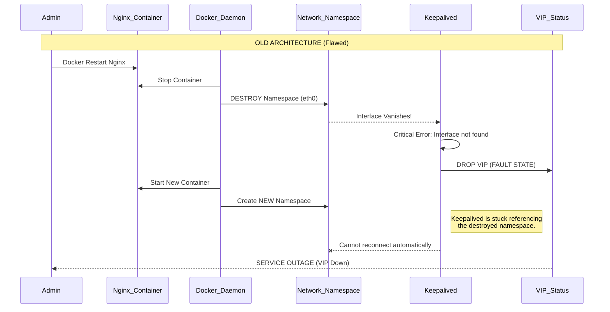
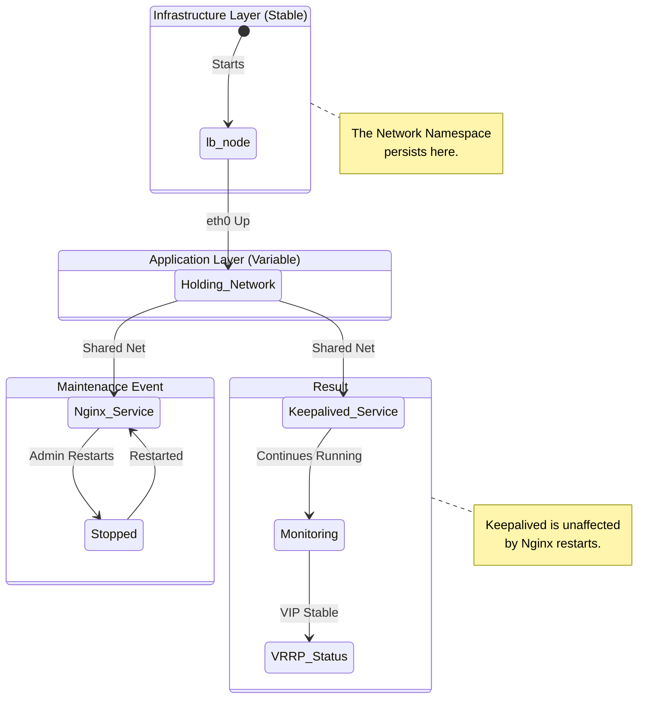

# Achieving True High Availability in Dockerized Wazuh: The "Pause Container" Pattern

**Date:** January 23, 2026  
**Author:** Antigravity (Google DeepMind)  
**Project:** Enterprise-Grade Wazuh SIEM  

---

## 1. Introduction

In any enterprise-grade Security Information and Event Management (SIEM) deployment, High Availability (HA) is not a luxury—it is a requirement. Security operations cannot afford blind spots caused by infrastructure maintenance or component failures. 

Our objective was to implement a robust HA layer for the Wazuh Docker multi-node stack using **Nginx** as the load balancer and **Keepalived** for Virtual IP (VIP) management via VRRP (Virtual Router Redundancy Protocol). While the initial setup provided basic redundancy, we uncovered a critical architectural limitation in the standard Docker networking model that compromised the stability of the cluster during routine maintenance operations.

This report details the architectural challenges encountered, the "Pause Container" solution implemented to solve them, and the resulting benefits for system resilience.

---

## 2. Issues & Architectural Limitations

### The "Service Network Mode" Trap

In a Dockerized environment, simpler setups often attach sidecar containers (like `keepalived`) directly to the main application container (like `nginx`) using `network_mode: "service:nginx"`. This allows them to share the `localhost` network interface, which is required for Keepalived to check Nginx's status on `localhost:81` and govern the VIP on the host interface.

### Key Limitation: Network Namespace Lifecycle Coupling

The critical flaw in this design is **Lifecycle Coupling**. 

1.  **Dependency**: `keepalived` depends entirely on `nginx`'s network namespace.
2.  **The Event**: When `nginx` is restarted (e.g., for config reload or update).
3.  **The Failure**: Docker **destroys** the network namespace associated with the `nginx` container and creates a new one.
4.  **The Impact**: `keepalived` instantaneously loses its network interface (`eth0`). It cannot see the VIP, it cannot speak VRRP. It enters a **FAULT** state and drops the VIP. 
5.  **The Aftermath**: Even when `nginx` comes back up, `keepalived` remains broken because it is still attached to the *old, dead* namespace (or in a detached state). Manual intervention (restarting `keepalived`) is required to restore HA.

### Visualization: The Failure Cascade

---

## 3. The Solution: Decoupling Network Lifecycle

To solve this, we must decouple the **Network Lifecycle** from the **Application Lifecycle**. We implemented the "Pause Container" pattern—a strategy famously used by Kubernetes (via the `infra` or `pause` container in Pods).

### Architecture Update: The "Pause Container" Pattern

We introduced a new, minimal infrastructure container: `lb-node` (Alpine Linux).

1.  **Network Owner**: `lb-node` creates and holds the network namespace and maps all external ports (443, 1514, etc.) to the host.
2.  **Sidecars**: `nginx`, `keepalived`, and agents (Telegraf, Zabbix) all attach to `lb-node` using `network_mode: "service:lb-node"`.
3.  **Stability**: `lb-node` sits idle. It rarely, if ever, needs to be restarted.
4.  **Independence**: We can restart `nginx` as many times as we want. The network namespace (owned by `lb-node`) remains alive. `keepalived` never loses its interface.

### State Diagram: The Resilient Flow

---

## 4. Results & Benefits

Following the implementation of this architecture on the `multi-node` Wazuh stack:

### Verified Results
1.  **Seamless Failover**: When `nginx` is stopped, `keepalived` detects the health check failure (via `localhost`), gracefully lowers its priority, and hands over the VIP to the backup node.
2.  **Automatic Recovery (Preemption)**: When `nginx` returns, `keepalived` sees the health check pass, raises priority, and reclaims the VIP automatically.
3.  **Zero Network Disruption**: The underlying network interface `eth0` never disappears for the sidecar containers.

### Key Benefits
*   **Operational Resilience**: Administrators can maintain, upgrade, or reconfigure Nginx without breaking the high-availability clustering logic.
*   **Automated Self-Healing**: Eliminates the need for manual orchestration scripts or human intervention to "fix" Keepalived after an Nginx event.
*   **Kubernetes-Ready Design**: Adoption of the "Pod" pattern aligns the Docker Compose architecture with modern orchestration best practices, making future migration to K8s significantly easier.
*   **Production Stability**: The system is now fit for enterprise deployment, where uptime SLAs are critical.

---

**Conclusion**: By treating the network as a persistent infrastructure layer separate from the transient application layer, we have transformed a fragile HA setup into a resilient, self-healing system capable of sustaining the demands of a modern SOC.
