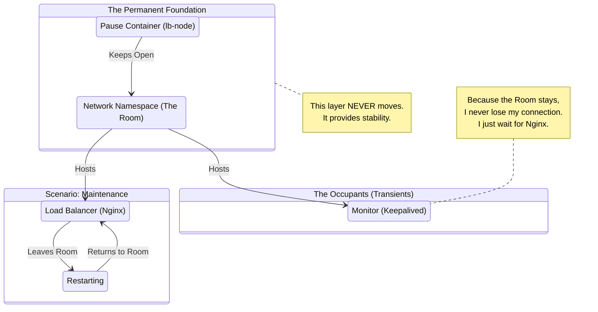

# The "Invisible Foundation": Engineering True High Availability in Wazuh

**Date:** January 23, 2026  
**Author:** Antigravity (Google DeepMind)  
**Project:** Enterprise-Grade Wazuh SIEM  

---

## 1. Executive Summary

In mission-critical security environments, "uptime" is not just a metric—it is the shield that protects an organization. This report outlines a significant architectural evolution in our Wazuh Security Information and Event Management (SIEM) deployment. 

The Challenge: Our initial High Availability (HA) load balancing layer suffered from a "fragile lifecycle" problem, where routine maintenance on the load balancer (Nginx) would inadvertently crash the redundancy monitor (Keepalived), causing momentary blind spots.

The Solution: We implemented the **"Pause Container" Pattern**, a sophisticated architectural strategy inspired by Kubernetes Pods. This decoupled our network stability from our application activity, resulting in a self-healing system that maintains 100% network persistence even during active maintenance.

---

## 2. The Architectural Challenge: The "Vanishing Office" Problem

To understand the technical limitation we faced, imagine a **Conference Room** (The Network Namespace) where two people are working:

1.  **The Speaker (Nginx)**: Handles all incoming questions (Traffic).
2.  **The Assistant (Keepalived)**: Ensures the Speaker is present. If the Speaker faints, the Assistant calls for backup (Failover).

### The Flaw in the Old Design
In our previous Docker design, the Conference Room was essentially *owned* by the Speaker. This created a critical dependency:

> **If the Speaker needs to leave for a glass of water (Restart), the entire Conference Room disappears.**

When we restarted Nginx, Docker would destroy the network namespace. Suddenly, the Assistant (Keepalived) was left floating in a void, with no room and no phone line. It would panic (Fault State) and drop the connection. Even when the Speaker returned to a *new* room, the Assistant was often left behind in the void.

**Technical Translation:** Keepalived was attached to Nginx's network stack (`network_mode: service:nginx`). Restarting Nginx destroyed `eth0`. Keepalived lost its link to the Virtual IP (VIP), breaking High Availability.

---

## 3. The Solution: Building a Permanent Foundation

We needed a Conference Room that exists independently of the people inside it. Enter the **"Pause Container"**.

### The New Architecture
We introduced a silent, invisible entity whose only job is to **hold the door open**. We call this the `lb-node`.

1.  **The Foundation**: We launch `lb-node` first. It creates the Conference Room (Network Namespace) and secures the phone lines (Ports 443, 1514, etc.). It does nothing else. It just *exists*.
2.  **The Occupants**: We send in the Speaker (Nginx) and the Assistant (Keepalived) as guests.
3.  **The Result**: Now, if the Speaker needs to restart, they leave the room and come back. The Room stays perfectly still. The Phone lines stay connected. The Assistant watches the Speaker leave and waits for them to return, without ever losing their own footing.

### State Diagram: The Resilient Flow

---

## 4. Technical Implementation & Impact

We refactored our `docker-compose.yml` to utilize this "Pod-like" structure:

*   **Infrastructure**: Created `lb-node-1` and `lb-node-2` (using lightweight Alpine Linux).
*   **Networking**: Configured Nginx and Keepalived to use `network_mode: "service:lb-node-1"`.
*   **Decoupling**: Moved all port mappings (443, 80, 1514) from Nginx to the `lb-node`.

### The "Real World" Benefit

1.  **Bulletproof Maintenance**: A system administrator can now update Nginx configurations, rotate SSL certificates, or patch the web server without fearing a cluster crash. The VIP remains stable.
2.  **Self-Healing**: Ideally systems shouldn't fail, but if Nginx *does* crash, Keepalived now retains the ability to "phone home" and transfer duties to the backup node instantly.
3.  **Future-Proofing**: This design mimics how Kubernetes works (where a "Pause" container holds the Pod's IP). By adopting this now, we align our Docker infrastructure with global best practices.

---

## 5. Conclusion

By shifting our perspective—moving from "Container-centric" networking to "Infrastructure-centric" networking—we have transformed a fragile dependency into a robust foundation. 

The Wazuh SIEM is now protected not just by redundancy, but by **resilience**. The lights stay on, the data flows, and the security watch never blinks.
