# 🛡️ The Network-Decoupled HA Architecture: Engineering Persistence in Containerized Load Balancing

**Author:** Abu Saeid  
**Date:** January 23, 2026  
**Status:** Validated & Deployed  
**Classification:** Technical Architecture Report  

---

## 1. Executive Summary

In enterprise-grade Security Information and Event Management (SIEM) deployments, High Availability (HA) is not merely a feature—it is a mandatory operational requirement. A common failing in containerized HA architectures involves the tight coupling of the network lifecycle with the application lifecycle. This report details the architectural evolution from a fragile **"Service-Bound Networking"** model to a robust **"Network-Decoupled"** model (The Pause Container Pattern).

By isolating the network namespace from the load balancer process (Nginx), we have achieved a state of **Persistence**. This architecture allows for seamless application maintenance, configuration reloading, and process restarts without dismantling the underlying network stack or dropping the Virtual IP (VIP) managed by Keepalived.

---

## 2. Technical Limitation: The "Coupled Lifecycle" Anti-Pattern

In standard Docker Compose deployments, network namespaces are typically instantiated and managed by the service container itself. This creates a critical "Single Point of Failure" (SPOF) not for the *traffic*, but for the *infrastructure* itself.

### 2.1 The Phenomenon: Namespace Ephemerality

When Nginx serves as the primary network holder (`network_mode: bridge` or `host`), the network namespace (`netns`) is bound to the Nginx process ID (PID).
1.  **Dependency Chain**: `Keepalived` depends on `Nginx`'s network stack (`network_mode: service:nginx`).
2.  **The Event**: An administrator restarts Nginx to apply a new configuration or rotates SSL certificates.
3.  **The Crash**: 
    -   Docker sends `SIGTERM` to Nginx.
    -   The Nginx container stops.
    -   **Critical Failure**: Docker tears down the network namespace.
    -   Keepalived acts as a "sidecar" attached to that namespace. When the namespace vanishes, Keepalived loses its interface (`eth0`). It enters a `FAULT` state and drops the VIP immediately.
    -   Redundancy fails because the *mechanism* of redundancy (Keepalived) was dependent on the *subject* of redundancy (Nginx).

### 2.2 Diagram: The "Fragile Cycle" (Limitations)

The following state diagram illustrates the destructive race condition inherent in the Service-Bound model.

```mermaid
stateDiagram-v2
    classDef fail fill:#ffcccc,stroke:#b30000,stroke-width:2px;
    classDef process fill:#e1f5fe,stroke:#01579b,stroke-width:2px;

    state "Normal Operation" as Normal {
        state "Nginx (PID 1)" as Nginx
        state "Network Namespace (eth0)" as NetNS
        state "Keepalived (Sidecar)" as KA
        
        Nginx --> NetNS : Owns/Creates
        KA --> NetNS : Binds to
    }

    state "Maintenance Event (Restart)" as Event {
        [*] --> StopCommand
        StopCommand --> KillNginx : SIGTERM
        KillNginx --> DestroyNetNS : Namespace Deleted
        DestroyNetNS --> KillKA : No Interface Found!
        KillKA --> VIP_Drop : VIP Lost ::: fail
    }

    Normal --> Event : Admin Action
```

---

## 3. The Solution: The "Pause Container" Pattern

To solve the "Vanishing Office" problem, we adapted the **Kubernetes Pod** networking model for a pure Docker environment. This involves introducing a deeply lightweight "infrastructure container" whose sole responsibility is to keep the network namespace alive.

### 3.1 Architecture: Decoupled Network Lifecycle

We introduced `lb-node` (a 5MB Alpine Linux container) as the **Network Holder**.
-   **Role**: Creates and holds ports `443`, `1514`, `55000`, etc.
-   **Behavior**: Executes `tail -f /dev/null`. It never restarts, never changes config, and never crashes.
-   **Dependents**: Nginx and Keepalived attach to *this* container's network stack.

Now, Nginx is merely a **guest** in the network namespace. It can come and go, crash and restart, but the "room" (the network interface and IP address) remains static.

### 3.2 Diagram: The Resilient Architecture

```mermaid
graph TD
    subgraph "Host Infrastructure"
        subgraph "Logical Node (Pod Equivalent)"
            style LB_NODE fill:#e8f5e9,stroke:#2e7d32,stroke-width:2px,stroke-dasharray: 5 5
            
            LB_NODE["🧱 lb-node (Alpine)<br/>(The Network Anchor)"] 
            
            subgraph "Shared Network Namespace"
                NIC["🔌 eth0 / IPs / Ports"]
            end
            
            LB_NODE --- NIC
            
            NGINX["🌐 Nginx (Load Balancer)"]
            KA["💓 Keepalived (High Availability)"]
            TEL["📊 Telegraf (Metrics)"]
            
            NGINX -.->|"network_mode: service:lb-node"| NIC
            KA -.->|"network_mode: service:lb-node"| NIC
            TEL -.->|"network_mode: service:lb-node"| NIC
        end
    end

    Admin["👨‍💻 Admin"] -->|"Restart Service"| NGINX
    
    NGINX -- "Restarts/Updates" --> NGINX_NEW["🌐 Nginx (New PID)"]
    
    NIC ===|"PERSISTS (No Flapping)"| KA
    KA ===|"HOLDS VIP (172.25.0.222 / wazuh.vip)"| VIP["Virtual IP"]
    
    style VIP fill:#fff9c4,stroke:#fbc02d,stroke-width:2px
```



### 3.3 State Diagram: Zero-Downtime Maintenance

This sequence shows how the system handles a restart *without* dropping connections.

```mermaid
sequenceDiagram
    participant Admin
    participant Pause as 🧱 lb-node
    participant NetNS as 🔌 Namespace
    participant KA as 💓 Keepalived
    participant Nginx as 🌐 Nginx

    Note over Pause, NetNS: Infrastructure is UP (Stable)
    NetNS->>KA: Interface Available (eth0)
    KA->>KA: VRRP Master (Holding VIP)

    Admin->>Nginx: docker restart nginx-lb-1
    Nginx->>Nginx: Process Terminated (SIGTERM)
    
    Note right of NetNS: Namespace PERSISTS because<br/>lb-node is still running.
    
    KA->>NetNS: Checks eth0... Still there.
    KA->>KA: Status: OK. Keeping VIP.
    
    Nginx->>Nginx: New Process Started
    Nginx->>NetNS: Re-attaches to Namespace
    
    Note over Admin, Nginx: ✅ Result: Logic Restarted, Network Stable.
```



---

## 4. Technical Implementation Details

The implementation requires a specific structure in `docker-compose.yml`.

### 4.1 The Anchor (Pause Container)
This container maps the ports. It replaces the Nginx container as the "public face" of the stack in terms of Docker networking.

```yaml
  # Infra Node 1 (The Anchor)
  lb-node-1:
    image: alpine:latest
    hostname: nginx-lb-1
    command: tail -f /dev/null  # Minimal footprint process
    restart: always
    ports:
      - "443:443"     # Dashboard
      - "1514:1514"   # Agent Traffic
      - "55000:55000" # API
      - "9200:9200"   # Indexer
    networks:
      - wazuh-net
```

### 4.2 The Dependents (Service Containers)
Crucially, these containers **DO NOT** map ports or define networks. They inherit the network context of the anchor.

```yaml
  # Load Balancer application
  nginx-lb-1:
    image: nginx:stable
    restart: always
    network_mode: "service:lb-node-1" # <--- THE CRITICAL DIRECTIVE
    depends_on:
      - lb-node-1

  # High Availability Manager
  keepalived-1:
    image: osixia/keepalived:2.0.20
    restart: always
    network_mode: "service:lb-node-1" # <--- SHARES SAME IP/INTERFACE
    cap_add:
      - NET_ADMIN
      - NET_BROADCAST
```

---

## 5. Challenges & Solutions Matrix

| Challenge | Impact | Technical Solution |
| :--- | :--- | :--- |
| **Namespace Destruction** | Keepalived loses `eth0` when Nginx restarts. | **Pause Container**: Dedicated container holds the namespace open indefinitely. |
| **Port Conflicts** | Cannot run multiple sidecars on `host` network easily. | **Service Networking**: Use `network_mode: service:container` to simulate a Pod environment. |
| **Zombie Processes** | If the pause container dies, everything becomes unreachable. | **Minimal Surface**: Use `alpine` (5MB) with simple `tail` command. Risk is near-zero compared to a complex web server. |
| **VIP Flapping** | Brief outages during configuration validation. | **Decoupling**: Validating nginx config (`nginx -t`) no longer affects the network layer. |

---

## 6. Verification & Stress Testing

To validate this architecture, we subjected the system to aggressive **"Chaos Testing"** by forcibly cycling the load balancers (`nginx-lb-1` and `nginx-lb-2`) while tracking agent connectivity.

### 6.1 stress Test Execution (Chaos Scenario)

We simulated catastrophic failure and rapid maintenance cycles using the following terminal commands to randomly stop and start the primary and backup load balancers:

```bash
# Chaos Loop: Randomly killing LB nodes
docker stop multi-node-nginx-lb-1-1
docker start multi-node-nginx-lb-1-1
docker stop multi-node-nginx-lb-2-1
docker stop multi-node-nginx-lb-1-1
docker start multi-node-nginx-lb-2-1
```

### 6.2 Real-Time Log Analysis

The follow `tail -f /var/ossec/logs/ossec.log` output demonstrates the system's resilience. Note the "Transport endpoint" errors (expected during the outage) followed immediately by successful reconnection **without human intervention**.

**Snippet 1: The Failover Event (Self-Healing)**
```log
2026/01/23 16:40:26 wazuh-agentd: ERROR: (1137): Lost connection with manager. Setting lock.
2026/01/23 16:40:26 wazuh-agentd: ERROR: (1216): Unable to connect to '[172.25.0.222]:1514/tcp': 'Transport endpoint is not connected'.
...
2026/01/23 16:40:36 wazuh-agentd: INFO: Trying to connect to server ([172.25.0.222]:1514/tcp).
2026/01/23 16:40:36 wazuh-agentd: INFO: (4102): Connected to the server ([172.25.0.222]:1514/tcp).
2026/01/23 16:40:36 wazuh-agentd: INFO: Server responded. Releasing lock.
2026/01/23 16:40:37 wazuh-logcollector: INFO: Agent is now online. Process unlocked, continuing...
```

**Snippet 2: Handling Race Conditions (Duplicate Name)**
During rapid cycling, the agent may attempt to re-enroll before the cluster state syncs. The system handles this gracefully:
```log
2026/01/23 16:41:45 wazuh-agentd: ERROR: Duplicate agent name: wazuh-master. Unable to add agent (from manager)
...
2026/01/23 16:42:15 wazuh-agentd: INFO: (4102): Connected to the server ([172.25.0.222]:1514/tcp).
2026/01/23 16:42:16 wazuh-agentd: INFO: Agent is now online. Process unlocked, continuing...
```

### 6.3 Verdict

1.  **Resilience Confirmed**: The system recovered 100% of the time.
2.  **Network Persistence**: The `lb-node` strategy prevented total network stack destruction.
3.  **Automatic Recovery**: No manual intervention was required to restore connectivity.

---

## 7. Conclusion

The transition to a **Pod-like Architecture** represents a maturity milestone for the Wazuh SIEM infrastructure. We have successfully mitigated the risks associated with application-layer instability affecting network-layer availability. 

By treating the network namespace as a **First-Class Citizen**—managed by a dedicated, immutable infrastructure component rather than a mutable application container—we ensure that the Wazuh Cluster is not just "Available", but fundamentally **Resilient**. This design is now the standard for all future multi-node deployments in this environment.
