# Enterprise-Grade Wazuh SIEM: The Ultimate Architecture Guide
## Advanced Load Balancing, High Availability & Full-Stack Observability

**Author:** Abu Saeid  
**Date:** January 24, 2026  
**Version:** 3.0.0 (Ultimate Whitepaper Edition)  
**Classification:** Enterprise Technical Manual  
**Repository:** [GitHub](https://github.com/SaeidSec/Docker-base-Enterprise-Grade-Wazuh-SIEM-Advanced-Load-Balancing-and-High-Availability-Architecture)

---

# Table of Contents
1.  [Executive Summary](#1-executive-summary)
2.  [Architectural Philosophy & Design Principles](#2-architectural-philosophy--design-principles)
3.  [Comprehensive System Architecture](#3-comprehensive-system-architecture)
4.  [Core Component Analysis: The Wazuh Engine](#4-core-component-analysis-the-wazuh-engine)
5.  [The "Network-Decoupled" High Availability Engine](#5-the-network-decoupled-high-availability-engine)
6.  [Full-Stack Observability Ecosystem](#6-full-stack-observability-ecosystem)
7.  [Advanced Log Management & Routing Strategies](#7-advanced-log-management--routing-strategies)
8.  [Offensive Defense: The Honeypot Ecosystem](#8-offensive-defense-the-honeypot-ecosystem)
9.  [Automated Vulnerability Management Strategy](#9-automated-vulnerability-management-strategy)
10. [Operational Manual: Deployment & Maintenance](#10-operational-manual-deployment--maintenance)
11. [Strategic Advantages & Future Roadmap](#11-strategic-advantages--future-roadmap)
12. [Conclusion](#12-conclusion)

---

## 1. Executive Summary

In the modern cybersecurity landscape, a Security Information and Event Management (SIEM) system is the heartbeat of the Security Operations Center (SOC). However, traditional "out-of-the-box" containerized deployments of SIEM platforms often fail to meet enterprise requirements for **persistence**, **resilience**, and **observability**.

This document details the engineering of a production-ready **Wazuh SIEM** architecture that transcends these limitations. By wrapping the core Wazuh engine in a sophisticated infrastructure layer, we have created a system that is:
*   **Self-Healing**: Capable of recovering from load balancer failures in milliseconds without dropping connections.
*   **Fully Observable**: Monitored by a dedicated compliance layer (Zabbix) that watches the watchers.
*   **Proactively Defensible**: Integrated with AI-driven honeypots and automated vulnerability scanners to detect threats before they breach the perimeter.

This is not just a logging server; it is a **cyber-resilience platform**.

---

## 2. Architectural Philosophy & Design Principles

The design of this system was driven by four non-negotiable engineering principles necessary for "Enterprise-Grade" status.

### 2.1 Principle of Persistence (The "Pause" Pattern)
In a containerized environment, network namespaces are typically ephemeral—tied to the lifecycle of the application container. This is unacceptable for a Load Balancer holding a Virtual IP (VIP).
*   **Our Solution**: We adopted the **Kubernetes Pod Model** within Docker Compose. We decouple the *network infrastructure* from the *application logic*. A dedicated, immutable "Pause Container" (`lb-node`) holds the network namespace/IP, while the application (Nginx) merely attaches to it. This allows the application to restart, crash, or upgrade without ever destroying the underlying network stack.

### 2.2 Principle of "Watching the Watchers"
A SIEM watches your infrastructure, but who watches the SIEM? If the SIEM's disk fills up or its API crashes, you are flying blind.
*   **Our Solution**: A dedicated **Zabbix Observability Layer**. Every single container in this stack has a "sidecar" Zabbix agent. This provides an external, independent verification of the SIEM's health, alerting on CPU spikes, buffer overflows, or database connectivity issues.

### 2.3 Principle of Unified Visibility
Security analysts should not have to toggle between five different screens to understand the state of the environment.
*   **Our Solution**: A unified **Grafana Dashboarding Layer** that aggregates:
    *   **Security Alerts** (from Wazuh/OpenSearch)
    *   **Infrastructure Health** (from Zabbix)
    *   **Performance Metrics** (from Prometheus)
    This "Single Pane of Glass" allows for the correlation of system performance with security events (e.g., "Is that CPU spike a DDoS attack?").

### 2.4 Principle of Active Defense
Passive logging is insufficient. An enterprise system must actively detect reconnaissance.
*   **Our Solution**: Integrated **Honeypots (Beelzebub & Cowrie)** that act as "canaries in the coal mine," detecting malicious intent at the perimeter before it touches critical assets.

---

## 3. Comprehensive System Architecture

The system is built as a highly coupled microservices mesh consisting of **32+ Docker containers**, organized into logical tiers.

### 3.1 System Architecture Diagram
The architecture is structured into logical layers, ensuring separation of concerns and clear data flow.

```mermaid
graph TD
    subgraph "External Entry (VIP 172.25.0.222)"
        VRRP["🛡️ Keepalived (Active/Passive)"]
    end

    subgraph "Layer 1: Load Balancing & Resilience"
        LB1["🌐 Nginx LB-1"]
        LB2["🌐 Nginx LB-2"]
        ANCHOR1[("⚓ lb-node-1 (Pause)")]
        ANCHOR2[("⚓ lb-node-2 (Pause)")]
        
        ANCHOR1 --- LB1
        ANCHOR2 --- LB2
    end

    subgraph "Layer 2: Application Tier"
        W_MASTER["👑 Wazuh Master"]
        W_WORKER["👷 Wazuh Worker"]
        W_DASH["📊 Wazuh Dashboard"]
    end

    subgraph "Layer 3: Data Tier (Distributed)"
        subgraph "Indexer Cluster"
            IDX1[("W-Indexer 1")]
            IDX2[("W-Indexer 2")]
            IDX3[("W-Indexer 3")]
        end
        MONGO[("🍃 MongoDB (Graylog)")]
        POSTGRES[("🐘 Postgres (Zabbix)")]
    end

    subgraph "Layer 4: Observability & Global SIEM"
        Z_SERVER["🔍 Zabbix 7.0 Server"]
        GRAFANA["📈 Grafana UI"]
        PROM["🔥 Prometheus"]
        GRAYLOG["📝 Graylog 7.0"]
    end

    subgraph "Layer 5: Threat Intel & active Defense"
        BEELZEBUB["😈 Beelzebub (AI HP)"]
        COWRIE["🐚 Cowrie (SSH HP)"]
    end

    %% Routing logic
    VRRP --> LB1
    LB1 --> W_DASH
    LB1 --> W_MASTER
    W_MASTER --> IDX1
    W_WORKER --> IDX1
    IDX1 --- IDX2 --- IDX3
    W_DASH --> IDX1
    
    BEELZEBUB -.->|"JSON Logs"| W_MASTER
    COWRIE -.->|"JSON Logs"| W_MASTER
    
    W_MASTER --> GRAYLOG
    GRAYLOG --> IDX1
    
    Z_SERVER --> POSTGRES
    GRAFANA --> Z_SERVER
    GRAFANA --> PROM
    GRAFANA --> IDX1
```



### 3.2 System Sequence Diagram: Security Event Lifecycle
This diagram illustrates the flow of a security event from an external agent to the final visualization.

```mermaid
sequenceDiagram
    autonumber
    participant Agent as 🖥️ Wazuh Agent
    participant VIP as 🛡️ Virtual IP (Keepalived)
    participant LB as 🌐 Nginx Load Balancer
    participant WM as 👑 Wazuh Manager (Master/Worker)
    participant IDX as 🗄️ Wazuh Indexer (OpenSearch)
    participant DB as 📊 Wazuh Dashboard
    participant GL as 📝 Graylog

    Agent->>VIP: Encrypted Log Stream (Port 1514)
    VIP->>LB: Transparent Pass-through
    LB->>WM: Consistent Hash Routing
    WM->>WM: Parse, Decode, & Match Rules
    
    Note over WM: Rule Level > Threshold?
    
    WM->>IDX: Index Alert (Filebeat SSL)
    WM-->>GL: Forward JSON Alert (Syslog)
    
    IDX->>DB: Synchronized Fetch
    DB->>Admin: Real-time SOC Dashboard
    
    GL->>Admin: Long-term Analysis & Archiving
```



### 3.3 Workflow Diagram: Automated Failover & Recovery
This workflow shows the resilience mechanism providing zero-downtime during a maintenance event or crash.

```mermaid
flowchart TD
    Start["▶️ Start Maintenance / Process Crash"] --> CheckPause{"Is 'lb-node' Anchor Running?"}
    
    CheckPause -- "Yes" --> NetStable["✅ Network Namespace Persists (IP stays UP)"]
    CheckPause -- "No" --> NetDown["❌ Network Flush (VIP DROPS)"]
    
    NetStable --> LB_Restart["🔄 Nginx LB Restarts/Reloads"]
    LB_Restart --> Reattach["🔗 Nginx Re-joins Anchor Namespace"]
    
    Reattach --> KA_Check{"Keepalived Health Check"}
    KA_Check -- "Success" --> HoldVIP["💎 VIP Remains on Node (Stabilized)"]
    KA_Check -- "Failure" --> Failover["🔀 VRRP Failover to Passive Node"]
    
    Failover --> BackupIP["✅ Backup Node Adopts VIP"]
    HoldVIP --> End["🚀 Service Resilience Maintained"]
    BackupIP --> End
```



### 3.4 Tier 1: The Resilience Layer (Networking & HA)
*   **Virtual IP (VIP)**: `172.25.0.222` (Aliased as `wazuh.vip` internally for decoupling).
*   **Protocol**: VRRP (Virtual Router Redundancy Protocol) via Keepalived.
*   **Load Balancers**: 2x Nginx nodes in Active/Passive configuration.
*   **Infrastructure Nodes**: 2x Alpine "Anchor" nodes holding the network namespaces.

### 3.2 Tier 2: The Control Plane (Wazuh Core)
*   **Master Node**: `wazuh.master` - Handles API requests, cluster coordination, and agent enrollment (`tcp/1515`).
*   **Worker Node**: `wazuh.worker` - Dedicated to event decoding, rule matching, and log ingestion to offload the Master.
*   **Communication**: Nodes sync via port `1516` using a pre-shared cluster key.

### 3.3 Tier 3: The Data Plane (Storage)
*   **Indexer Cluster**: 3x `wazuh-indexer` nodes (OpenSearch) forming a quorum-based storage cluster.
*   **Databases**:
    *   **PostgreSQL**: For Zabbix structural data.
    *   **MongoDB**: For Graylog metadata.
    *   **Prometheus TSDB**: For high-volume time-series metrics.

### 3.4 Tier 4: The Observability Plane
*   **Monitoring Server**: Zabbix Server 7.0.
*   **Metric Collectors**: 13x Zabbix Agents, 2x Telegraf Agents, cAdvisor, Node Exporter.
*   **Visualization**: Grafana & Zabbix Web.

### 3.5 Tier 5: The Threat Intel Plane
*   **Internal Scanners**: Trivy (scanning the Docker socket).
*   **External Traps**: Beelzebub (ssh/http) and Cowrie (ssh/telnet).

---

## 4. Core Component Analysis: The Wazuh Engine

### 4.1 Wazuh Managers (Master & Cluster)
*   **Image**: `wazuh/wazuh-manager:4.14.1`
*   **Role Setup**:
    *   The **Master** is configured via `cluster.node_type=master`. It holds the authoritative copy of the client keys and ruleset.
    *   The **Worker** is configured via `cluster.node_type=worker`. It connects to the master to sync configuration but processes agent data independently.
*   **SSL Integration**:
    *   The Managers use **Filebeat** (embedded) to ship logs to the Indexer Cluster.
    *   **Security**: Full SSL output verification is enabled (`FILEBEAT_SSL_VERIFICATION_MODE=full`). Certificates are mounted from `./config/wazuh_indexer_ssl_certs`.

### 4.2 Wazuh Indexers (OpenSearch)
*   **Image**: `wazuh/wazuh-indexer:4.14.1`
*   **Cluster Logic**:
    *   **Bootstrap Checks**: Enforced. Memory lock (`bootstrap.memory_lock=true`) is enabled to prevent swapping, which is fatal for Lucene performance.
    *   **JVM Heap**: Pinned at 1GB (`-Xms1g -Xmx1g`) per node. In production, this should be 50% of available RAM.
    *   **Discovery**: The 3 nodes (`wazuh1`, `wazuh2`, `wazuh3`) form a mesh. `wazuh1` is the initial master-eligible node.

### 4.3 Wazuh Dashboard
*   **Image**: `wazuh/wazuh-dashboard:4.14.1`
*   **Connectivity**: Connects to the Indexer Cluster via HTTPS/9200.
*   **API Access**: Connects to the Wazuh Master API via the Load Balancer VIP (`https://172.25.0.222`) to perform agent management actions from the UI.

---

## 5. The "Network-Decoupled" High Availability Engine

This section details the custom engineering that makes this system uniquely resilient.

### 5.1 The "Pause Container" Mechanics
Standard Docker containers bind the network namespace to the PID 1 of the container. If that process dies (Nginx crash or restart), the namespace is garbage collected by the kernel.
*   **Our Innovation**: We introduce `lb-node-1` and `lb-node-2`.
    *   **Image**: `alpine:latest`
    *   **Command**: `tail -f /dev/null` (An infinite, low-resource loop).
    *   **Function**: This container creates the network interfaces (`eth0`, `lo`) and exposes the ports (`443`, `1514`, `55000`, etc.) to the host.

### 5.2 Service Attachment
The functional containers (`nginx-lb` and `keepalived`) are deployed with:
```yaml
network_mode: "service:lb-node-1"
```
This instructs Docker to **not** create a new network stack for them, but instead to join the existing namespace of the `lb-node`. They see `localhost` as the same interface. They share the same IP.

### 5.3 Nginx Configuration Strategy (`nginx_ha.conf`)
*   **L4 Streaming (TCP/UDP)**:
    *   For Wazuh Agent traffic (1514), we use **Consistent Hashing** (`hash $remote_addr consistent`). This ensures that a specific agent always reconnects to the same Manager worker unless that worker is down. This is crucial for keeping partial log fragments together.
*   **L7 Proxying (HTTP)**:
    *   For the Dashboard, Grafana, and Zabbix UI, Nginx acts as a standard Reverse Proxy.
    *   **Hardening**:
        *   **Global Timeouts**: `proxy_connect_timeout`, `proxy_send_timeout`, and `proxy_read_timeout` set to 60s to prevent hanging connections.
        *   **Health Checks**: Upstreams configured with `max_fails=3 fail_timeout=30s` to intelligently avoid failing backends.
        *   **Security Headers**: Injected `X-Forwarded-Proto $scheme` for HTTPS redirection and `Upgrade`/`Connection` headers to support WebSockets (crucial for Grafana Live).

### 5.4 Keepalived VRRP Logic
*   **State Machine**:
    *   Node 1 is `MASTER` (Priority 101).
    *   Node 2 is `BACKUP` (Priority 100).
*   **Health Check Script**: A lightweight script curls `http://localhost:81/nginx_status` every 3 seconds.
    *   If Nginx responds, weight remains +0.
    *   If Nginx fails, priority is decremented by 20 (Result: 81), prompting the Backup node (Priority 100) to preemptively take over the VIP.

---

## 6. Full-Stack Observability Ecosystem

### 6.1 Zabbix Architecture (Active Monitoring)
The Zabbix implementation here is massive.
*   **Zabbix Server**: The brain, processing metrics from 13 active agents.
*   **Agents**: Deployed in `privileged: true` mode alongside key components.
*   **Key Metrics Monitored**:
    *   **Wazuh Queues**: Monitoring `/var/ossec/var/run/ossec-queue` to detect log congestion.
    *   **Disk Usage**: Vital for the Indexer nodes (OpenSearch stops writing at 95% disk usage).
    *   **Database Connectivity**: Checks if PostgreSQL and MongoDB are accepting connections.
    *   **Process State**: "Is `wazuh-remoted` running?"

### 6.2 Prometheus & Telegraf (Performance Metrics)
*   **Telegraf Sidecar**: Runs attached to the `lb-node`. It reads Nginx's `stub_status` module to report:
    *   Active connections.
    *   Requests per second.
    *   Handing/Writing states.
*   **Prometheus**: Scrapes Telegraf and cAdvisor. It maintains a 200-hour retention history (`--storage.tsdb.retention.time=200h`), allowing for trend analysis (e.g., "Are we receiving more logs on Mondays?").

### 6.3 Grafana (Unified Visualization)
Grafana sits on top of this, connected to:
1.  **OpenSearch**: For visualizing security alerts (Wazuh data).
2.  **Zabbix**: For visualizing infrastructure up/down states.
3.  **Prometheus**: For detailed time-series performance graphs.

---

## 7. Advanced Log Management & Routing Strategies

### 7.1 Graylog 7.0 Deployment
While Wazuh is excellent for security, it is expensive to index *everything* into it. Graylog provides a tiered log management strategy.
*   **Integration**: Wazuh Managers are configured to forward alerts via Syslog (JSON format) to Graylog on port `1515`.
*   **Use Case**: Graylog serves as a "Data Lake" for long-term retention or for routing logs to other systems (e.g., archival storage) without burdening the high-performance Wazuh Indexers.

### 7.2 Filebeat Integration
Inside the Wazuh Managers, Filebeat is the transport mechanism.
*   **Config**: It reads `/var/ossec/logs/alerts/alerts.json`.
*   **Output**: Compressed HTTPS stream to the Indexer Cluster (`https://wazuh{1,2,3}.indexer:9200`).
*   **Resilience**: Filebeat ensures "at-least-once" delivery. If Indexers are down, it buffers logs on disk until connectivity is restored.

---

## 8. Offensive Defense: The Honeypot Ecosystem

This architecture turns the table on attackers by deploying decoys.

### 8.1 Beelzebub (AI Honeypot)
*   **Technology**: Go-based, AI-driven low-medium interaction.
*   **Simulation**: Exposes a fake SSH service on port `2222` and a fake WordPress site on `8000`.
*   **AI Logic**: Uses a GPT-like model to generate realistic command responses, tricking automated bots into thinking they have successfully breached a system, keeping them engaged while logging their TTPs (Tactics, Techniques, and Procedures).
*   **Log Flow**: JSON logs are written to a shared volume mapped to the Wazuh Manager. Wazuh uses a `<localfile>` block to tail these logs and generate specific alerts ("Honeypot Triggered: SSH Brute Force").

### 8.2 Cowrie (Interaction Trap)
*   **Technology**: Python-based high-interaction SSH/Telnet proxy.
*   **Function**: It mimics a UNIX filesystem. Attackers can `wget` malware, `cd` into directories, and run commands.
*   **Forensics**: Cowrie captures the actual binaries downloaded by attackers. These are stored in `cowrie-var` for malware analysis by the SOC team.

---

## 9. Automated Vulnerability Management Strategy

### 9.1 Trivy Integration Model
Instead of relying solely on Wazuh's "Vulnerability Detector" (which checks installed packages against CVE databases), we integrate **Trivy** for active container scanning.

### 9.2 The Scanner Script (`trivy_scan.sh`)
This custom script is the bridge between Trivy and Wazuh.
1.  **Execution**: Runs every 3 days via Wazuh's Command Module.
2.  **Access**: Mounts `/var/run/docker.sock` (Read-only) to see all containers on the host.
3.  **Scan Logic**:
    *   Iterates through every running container image.
    *   Executes `trivy image` with a custom output format.
    *   Injects a `Trivy:` header into the output.
4.  **Ingestion**: Wazuh Manager captures the `stdout` of this script.
5.  **Decoding**: A custom decoder matches the `Trivy:` header and extracts fields like `Package`, `Severity`, `CVE-ID`.
6.  **Alerting**: Rules trigger alerts based on severity (e.g., "Critical Vulnerability found in Nginx Image").

---

## 10. Operational Manual: Deployment & Maintenance

### 10.1 Pre-Flight Check
Before deployment, the host must be prepared:
1.  **Kernel Tuning**: `vm.max_map_count` must be set to `262144` (required for OpenSearch mmapfs).
2.  **Resources**: Ensure at least 16GB RAM is available.
3.  **Ports**: Ensure ports 443, 1514, 1515, 55000, 80, 2222, 2223 are free.

### 10.2 Deployment Sequence (Critical Order)
1.  **Certificates**: Run `docker-compose -f generate-indexer-certs.yml run --rm generator` to create the SSL chain of trust.
2.  **Network**: `docker network create wazuh-net`.
3.  **Storage**: `docker-compose up -d wazuh1.indexer wazuh2.indexer wazuh3.indexer`. *Wait for green health.*
4.  **Core**: `docker-compose up -d wazuh.master wazuh.worker wazuh.dashboard`.
5.  **Infrastructure**: `docker-compose up -d lb-node-1 lb-node-2 nginx-lb-1 nginx-lb-2 keepalived-1 keepalived-2`.
6.  **Observability**: `docker-compose up -d zabbix-postgres zabbix-server grafana prometheus`.

### 10.3 Scaling the Cluster
*   **Adding Indexers**: Simply duplicate the `wazuh3.indexer` service definition, update the certificate generation `instances.yml`, and add the new node to `nginx_ha.conf`.
*   **Adding Workers**: Duplicate `wazuh.worker`, ensuring it shares the same `INDEXER_URL` and `cluster.key`.

---

## 11. Strategic Advantages & Future Roadmap

### 11.1 Strategic Advantages
*   **Resilience**: The architecture can suffer the loss of any single node (Indexer, Manager, LB, HA) and continue processing security events.
*   **Cost Efficiency**: By using Open Source components (Wazuh, Zabbix, Graylog) instead of commercial alternatives (Splunk, Datadog), licensing costs are zero.
*   **Compliance Ready**: The archival capabilities of Graylog + the integrity monitoring (FIM) of Wazuh meet strict PCI-DSS and HIPAA log retention requirements.

### 11.2 Future Roadmap
*   **Kubernetes Migration**: The "Pod-like" structure of the Docker Compose file is deliberately designed to make migration to Helm charts seamless.
*   **SOAR Automation**: Future integration with **Shuffle** or **n8n** to automatically block IPs on the firewall when a honeypot is triggered.
*   **AI Analysis**: Implementing local LLMs (like Ollama) to parse unstructured logs and provide natural language summaries of incidents.

---

## 12. Conclusion

The **Enterprise-Grade Wazuh SIEM** architecture described herein is a testament to modern security engineering. It rejects the fragility of simple deployments in favor of a robust, layered, and observable fortress.

By treating the Security Infrastructure with the same rigor as mission-critical application infrastructure—implementing High Availability, detailed monitoring, and failover logic—we ensure that the organization's "Digital Eyes" are always open, always watching, and always ready to respond. This is the definition of **Cyber Resilience**.

---
**End of Ultimate Documentation**
