# Enterprise-Grade Wazuh SIEM: Advanced HA, Monitoring & Security Architecture

**Author:** Abu Saeid  
**Date:** January 24, 2026  
**Version:** 1.0.0  
**Classification:** Technical Master Documentation

---

## 1. Overview
This document serves as the definitive technical reference for the **Docker-based Enterprise-Grade Wazuh SIEM** project. Unlike standard Wazuh deployments, this architecture is engineered for **resilience, visibility, and multi-layered defense**. It integrates high-availability load balancing, exhaustive observability stacks, multi-source log management, and proactive threat intelligence via AI-powered honeypots and automated vulnerability scanning.

## 2. Introduction
In the contemporary threat landscape, a Security Information and Event Management (SIEM) system must be more than a log aggregator; it must be a resilient, self-healing, and observable cornerstone of the Security Operations Center (SOC).

The **Wazuh SIEM** is a powerful, open-source platform for threat detection, compliance, and incident response. However, deploying it in a production environment requires addressing critical infrastructure challenges:
- **Persistence**: Ensuring the SIEM remains available even during maintenance or component failure.
- **Observability**: Monitoring the health of the SIEM itself to detect performance bottlenecks or resource exhaustion.
- **Integration**: Correlating security events from diverse sources like honeypots and container scanners.

This project addresses these needs by wrapping the core Wazuh engine in a sophisticated infrastructure layer.

## 3. Motivations
The development of this architecture was driven by three primary objectives:

1.  **Engineering Zero-Downtime Resilience**: Moving away from fragile, process-bound networking to a "Network-Decoupled" model that prevents Virtual IP (VIP) dropping during load balancer restarts.
2.  **Unified Security Visibility**: Creating a single ecosystem where Wazuh alerts, Zabbix performance metrics, and Graylog's deep log analysis coexist harmoniously.
3.  **Proactive Defense-in-Depth**: Integrating honeypots (Beelzebub and Cowrie) to capture early-stage reconnaissance and Trivy to identify vulnerabilities before they are exploited.

## 4. Wazuh Default Multi-Node Core Components
Before detailing the enterprise enhancements, it is essential to understand the foundation. This project utilizes a **multi-node Wazuh cluster** (version 4.14.1), consisting of:

-   **Wazuh Master Manager**: The coordinator of the cluster. It manages the API, agent enrollment, and orchestrates active responses.
-   **Wazuh Worker Manager**: The workhorse of the environment. It handles event processing, analysis, and log aggregation from the agents.
-   **Wazuh Indexers (OpenSearch Cluster)**: A 3-node cluster providing highly available and distributed storage. It indexes security data for search and visualization.
-   **Wazuh Dashboard**: The intuitive web interface (OpenSearch Dashboards fork) used for visualizing security events, managing agents, and monitoring compliance.

---

## 5. Project Details: The Enterprise Evolution

### 5.1 Why This System is Better for Enterprise Grades
The following comparison highlights why this architecture surpasses the standard "Out-of-the-Box" Wazuh Docker multi-node setup.

| Feature Area | Standard Wazuh Docker | This Enterprise Architecture |
| :--- | :--- | :--- |
| **Availability** | Single entry point or fragile HA. | **Active/Passive HA** with VRRP (Keepalived) & Nginx. |
| **Networking** | Process-bound (Restart = Outage). | **Network-Decoupled (Pause Container Pattern)** |
| **Monitoring** | Internal Wazuh health only. | **Full Stack Observability** (Zabbix, Prometheus, Grafana). |
| **Log Management** | Searchable indices only. | **Intermediated Log Management** with Graylog 7.0. |
| **Vulnerability** | Periodic agent scans. | **Real-time Container Scanning** with integrated Trivy. |
| **Intelligence** | External feeds only. | **Internal Threat Intel** via Beelzebub/Cowrie Honeypots. |

#### The "Pause Container" Advantage
The most significant innovation in this project is the **Network-Decoupled Model**. In standard Docker, restarting Nginx tears down the network namespace, causing Keepalived to drop the VIP. By using a lightweight `lb-node` (Alpine-based) as a "Network Anchor," we ensure the network namespace persists regardless of the application state. Nginx-LB is merely a "guest" in the namespace, allowing for zero-downtime maintenance.

### 5.2 Project Features: Complete Details

#### ✅ Advanced High Availability
- **Virtual IP (VIP)**: A single entry point (172.25.0.222) for all traffic.
- **Failover Logic**: Keepalived monitors node health; if the primary LB fails, the backup claims the VIP in milliseconds.
- **Load Balancing**: Nginx handles SSL/TLS termination and distributes traffic to the Wazuh Cluster (API, Dashboard, Indexers).

#### ✅ Comprehensive Observability Stack
- **Zabbix 7.0**: A dedicated 16-container monitoring swarm. Every component has a Zabbix Agent sharing its network namespace for precise metrics.
- **Prometheus & cAdvisor**: Collects real-time Docker resource usage (CPU, Memory, Disk I/O).
- **Grafana**: Unified dashboards visualizing data from Zabbix, Prometheus, and the Wazuh Indexers (OpenSearch) on a single pane of glass.

#### ✅ Enterprise Log Management (Graylog 7.0)
- **Log Aggregation**: Forwards non-security or high-volume logs to Graylog to keep the Wazuh Indexers lean.
- **Search Experience**: Offers advanced stream-based filtering and custom log processing pipelines.

#### ✅ Integrated Threat Intelligence (Honeypots)
- **Beelzebub**: An AI-powered honeypot providing interactive SSH decoy responses and a fake WordPress frontend.
- **Cowrie**: A high-interaction SSH/Telnet honeypot that captures attacker commands and malware payloads.
- **Log Integration**: Honeypot logs are mounted directly into Wazuh Managers, triggering custom alerts when malicious interaction is detected.

#### ✅ Automated Vulnerability Management (Trivy)
- **Container Scanning**: Trivy is integrated into the Wazuh Manager, scanning the local Docker socket for vulnerabilities in all running images.
- **Alerting**: Scan results are parsed by custom Wazuh decoders, generating alerts graded by severity (Critical to Low).

---

## 6. Tools & Technology Stack

This project leverages a sophisticated, multi-vendor technology stack to achieve its security and availability goals.

### 6.1 Core Security & Log Engines
- **Wazuh (4.14.1)**: Open-source SIEM for detection and response.
- **OpenSearch (Indexer/Dashboard)**: Backend for data storage and UI.
- **Graylog (7.0.3)**: Enterprise-grade log management and analysis.
- **MongoDB (7.0)**: Metadata storage for Graylog.

### 6.2 Availability & Load Balancing
- **Nginx (Stable)**: L7 load balancer and reverse proxy.
- **Keepalived (2.0.20)**: VRRP implementation for Virtual IP failover.
- **Alpine Linux (Latest)**: Used for the `lb-node` "Pause Container."

### 6.3 Observability & Monitoring
- **Zabbix (7.0)**: Server, Web UI, and Agents for infra monitoring.
- **PostgreSQL (16)**: Database backend for Zabbix.
- **Prometheus (Latest)**: Time-series database for metrics.
- **Grafana (Latest)**: Visualization and dashboard engine.
- **cAdvisor**: Container-level resource analysis.
- **Node Exporter**: Host-level telemetry.
- **Telegraf (Alpine)**: Specialized metrics collector for Nginx.

### 6.4 Threat Intelligence (Honeypots)
- **Beelzebub (Latest)**: AI-driven SSH/HTTP honeypot.
- **Cowrie (Latest)**: High-interaction SSH/Telnet honeypot.

---

## 7. System Design & Diagrams

### 7.1 System Architecture Diagram
The architecture is structured into logical layers, ensuring separation of concerns and clear data flow.

```mermaid
graph TD
    subgraph "External Access (VIP 172.25.0.222)"
        VRRP["🛡️ Keepalived (Active/Passive)"]
    end

    subgraph "Layer 1: Load Balancing"
        LB1["🌐 Nginx LB-1"]
        LB2["🌐 Nginx LB-2"]
        ANCHOR1[("⚓ lb-node-1")]
        ANCHOR2[("⚓ lb-node-2")]
        
        ANCHOR1 --- LB1
        ANCHOR2 --- LB2
    end

    subgraph "Layer 2: Application Tier"
        W_MASTER["👑 Wazuh Master"]
        W_WORKER["👷 Wazuh Worker"]
        W_DASH["📊 Wazuh Dashboard"]
    end

    subgraph "Layer 3: Data Tier"
        subgraph "Indexer Cluster"
            IDX1[("W-Indexer 1")]
            IDX2[("W-Indexer 2")]
            IDX3[("W-Indexer 3")]
        end
        MONGO[("🍃 MongoDB (Graylog)")]
        POSTGRES[("🐘 Postgres (Zabbix)")]
    end

    subgraph "Layer 4: Observability & Log Mgmt"
        Z_SERVER["🔍 Zabbix Server"]
        GRAFANA["📈 Grafana UI"]
        PROM["🔥 Prometheus"]
        GRAYLOG["📝 Graylog 7.0"]
    end

    subgraph "Layer 5: Threat Intel (Honeypots)"
        BEELZEBUB["😈 Beelzebub"]
        COWRIE["🐚 Cowrie"]
    end

    %% Connections
    VRRP --> LB1
    LB1 --> W_DASH
    LB1 --> W_MASTER
    W_MASTER --> IDX1
    W_WORKER --> IDX1
    IDX1 --- IDX2 --- IDX3
    W_DASH --> IDX1
    
    BEELZEBUB -.->|"Shared Volume"| W_MASTER
    COWRIE -.->|"Shared Volume"| W_MASTER
    
    W_MASTER --> GRAYLOG
    GRAYLOG --> IDX1
    
    Z_SERVER --> POSTGRES
    GRAFANA --> Z_SERVER
    GRAFANA --> PROM
    GRAFANA --> IDX1
```

### 7.2 System Sequence Diagram: Security Event Lifecycle
This diagram illustrates the flow of a security event from an external agent to the final visualization.

```mermaid
sequenceDiagram
    autonumber
    participant Agent as 🖥️ Wazuh Agent
    participant VIP as 🛡️ Virtual IP (Keepalived)
    participant LB as 🌐 Nginx Load Balancer
    participant WM as 👑 Wazuh Manager (Master/Worker)
    participant IDX as 🗄️ Wazuh Indexer (OpenSearch)
    participant DB as 📊 Wazuh Dashboard
    participant GL as 📝 Graylog

    Agent->>VIP: Send Security Event (Port 1514)
    VIP->>LB: Forward to Active Node
    LB->>WM: Route to available Manager
    WM->>WM: Parse, Decode, & Match Rules
    
    Note over WM: If matched rule level > threshold
    
    WM->>IDX: Store Alert (Filebeat)
    WM-->>GL: Forward Alert (Syslog/GELF)
    
    IDX->>DB: Fetch for Visualization
    DB->>Admin: Display Security Alert
    
    GL->>Admin: Deep Log Correlation & Analytics
```

### 7.3 Workflow Diagram: Automated Failover & Recovery
This workflow shows the resilience mechanism providing zero-downtime during a maintenance event or crash.

```mermaid
flowchart TD
    Start["▶️ Start Maintenance / LB Crash"] --> CheckPause{"Is 'lb-node' Running?"}
    
    CheckPause -- "Yes" --> NetStable["✅ Network Namespace Persists"]
    CheckPause -- "No" --> NetDown["❌ Network Cleanup (FAIL)"]
    
    NetStable --> LB_Restart["🔄 Nginx LB Restarts/Reloads"]
    LB_Restart --> Reattach["🔗 Nginx Re-attaches to Namespace"]
    
    Reattach --> KA_Check{"Keepalived Health Check"}
    KA_Check -- "OK" --> HoldVIP["💎 VIP Remains on Node (No Flapping)"]
    KA_Check -- "Fail" --> Failover["🔀 VRRP Failover to Backup Node"]
    
    Failover --> BackupIP["✅ Backup Node Claims VIP"]
    HoldVIP --> End["🚀 Recovery Complete (Zero/Minimal Downtime)"]
    BackupIP --> End
```

---

## 8. Deployment Process & Environment

Deploying this enterprise stack requires a systematic approach to ensure all components communicate securely.

### 8.1 Environment Requirements
- **OS**: Linux (Ubuntu 22.04+ recommended).
- **Docker**: Engine 20.10+ & Docker Compose v2.
- **Resources**: Minimum 16GB RAM (32GB recommended for high volume), 4+ CPU Cores.

### 8.2 Deployment Sequence
1.  **Certificate Generation**: Run the `indexer-certs-creator` to generate self-signed CA and node-specific SSL certificates.
2.  **Kernel Tuning**: Increase `vm.max_map_count` to at least `262144` for the Indexers.
3.  **Network Initialization**: Establish the `wazuh-net` bridge with the 172.25.0.0/16 subnet.
4.  **Core Stack Launch**: Start the Indexers first, followed by the Wazuh Managers and Dashboard.
5.  **Infrastructure Initialization**: Deploy the `lb-node` anchors and the Nginx/Keepalived containers.
6.  **Observability Layer**: Launch the Zabbix PostgreSQL database, Zabbix Server, and the Grafana/Prometheus stack.
7.  **Honeypot Deployment**: Start Beelzebub and Cowrie, ensuring shared volumes are correctly mounted into the Wazuh Managers.
8.  **Vulnerability Scanner**: Integrate Trivy by mounting the Docker socket into the Wazuh Master container.

---

## 9. Advantages of This Architecture

-   **Unrivaled Persistence**: The "Pause Container" strategy eliminates the most common cause of VIP flapping in containerized environments.
-   **Multi-Dimensional Detection**: Combines traditional SIEM agent alerts with active honeypot interaction and vulnerability scanning results.
-   **Deep Observability**: Every single container (32 total) is monitored by a dedicated Zabbix agent, providing granular visibility into performance.
-   **Scalability**: The 3-node Indexer cluster and multi-node Manager setup allow the system to scale horizontally as the agent count increases.
-   **Vendor Neutrality**: Built entirely on open-source and community-edition components, avoiding vendor lock-in.

## 10. Future Scope

-   **Automated Incident Response**: Expanding "Active Response" to automatically isolate containers identified as vulnerable by Trivy.
-   **SOAR Integration**: Connecting the stack to a Security Orchestration, Automation, and Response (SOAR) platform like Shuffle.
-   **AI-Enhanced Analysis**: Implementing local LLMs to analyze honeypot interaction logs in real-time for intent classification.
-   **Dynamic Scaling**: Automating the addition of Wazuh Worker nodes based on CPU/Memory load detected by Zabbix.

## 11. Limitations

-   **Resource Intensive**: Running 32+ containers requires significant hardware resources.
-   **Configuration Complexity**: The interdependent nature of the containers (especially the shared networking) requires careful management.
-   **Learning Curve**: Managing three different dashboards (Wazuh, Zabbix, Grafana) requires diverse technical expertise.

---

## 12. Conclusions

The **Enterprise-Grade Wazuh SIEM** architecture represents a significant leap forward in production-ready security operations. By treating the infrastructure with the same level of care as the security rules, we have created a platform that is not only effective at detecting threats but also resilient against operational failures. 

From the innovative **Pause Container** networking to the exhaustive **Zabbix/Prometheus** monitoring and the proactive **Honeypot/Trivy** integrations, this project provides a blue-print for high-availability security management in modern, containerized environments.

---
**End of Master Documentation**
